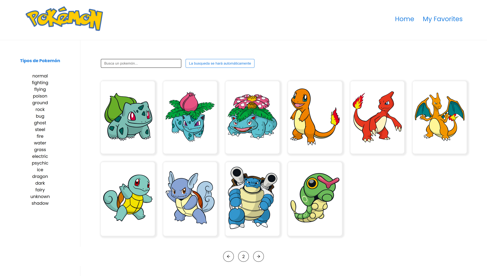

# Pokemon App



Antes de ejecutar el proyecto, se debe de instalar las dependencias.

```
npm install
```

Parra correr el proyecto

```
  npm run dev
  ó
  yarn dev
```

## Stack principal

- react redux toolkit
- react toastify
- sass
- react router dom v6
- react icons
- vite

## Página súbida en Netlify

url_page: https://sweet-sherbet-78d691.netlify.app/
